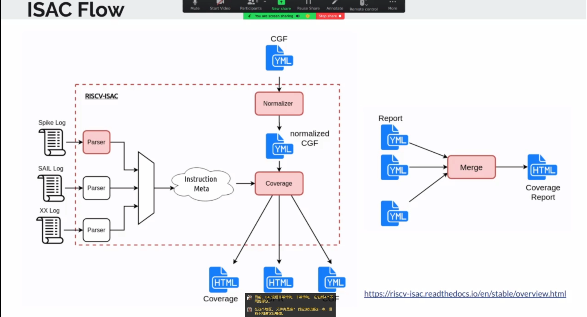

# 7.1 Architectural Compatible Test SIG Meeting

会议主要内容：

1. 基于 Verilog 的 ACT 覆盖点 - [ Umer Shahid]
2. ACT Repo 发布会议 - [ 所有 ACT 维护者]

## 基于 Verilog 的 ACT 覆盖点

提议来源于Umer Shahid于几周前参加的会议中的内容，他们认为可以根据覆盖范围来进行覆盖点定义,目前多数开发者都不喜欢使用YAML和CGF格式来编写他们的覆盖点，因此他提议将系统设计成基于模拟的覆盖点并添加支持，同时提到了当前ISAC的流程非常传统

对于验证工程师来说，cgf格式文件很难理解，而相对而言的SV格式则容易理解很多

后续讨论的主要问题在于在RISCV中强调的是不会提供实施方案，但是在系统模拟环境中进行的这些工作就非常接近于实现，因此有人担心会因此牵扯出一系列问题，而Umer Shahid认为该方案被广泛使用的前提下不会有什么大的问题，而且ACT的目的是得到测试的结果，因此需要足够的测试范围，不需要在于实际实施的结果如何，只需要拥有自己的参考模型就足够了

更改方案的另一个好处就是，系统模拟方案下的文件更人性化更易读，并且可以灵活的调整当前定义的内容，同时因为该原因会让更多的工程师加入，因为相对应的文件变得易读易理解

## ACT Repo 发布会议

会议上查看了ACT仓库的[PR473](https://github.com/riscv-non-isa/riscv-arch-test/pull/473),讨论后认为修改顺序不会影响过多，因此同意合入

会议上查看了ACT仓库的[PR471](https://github.com/riscv-non-isa/riscv-arch-test/pull/471),讨论后认为pr自带的测试时间较短，因此暂时搁置

会议上查看了ACT仓库的[PR469](https://github.com/riscv-non-isa/riscv-arch-test/pull/469),讨论后认为修改较为合理，因此同意合入