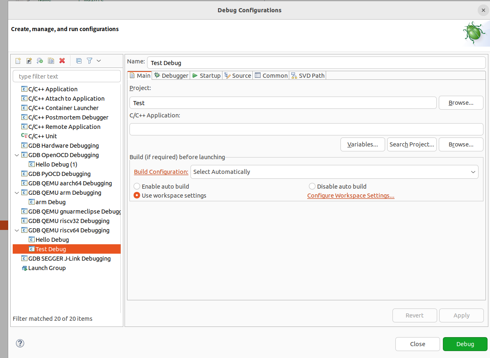
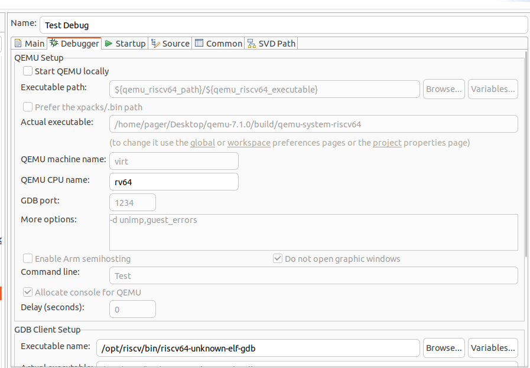

# Eclipse CDT RISC-V GDB调试过程调研结果

## 概述

Eclipse Embedded CDT插件原生支持通过OpenOCD GDB及RISC-V 64 QEMU GDB调试，当前RISC-V 64 QEMU GDB调试存在许多缺陷及不足，使用Eclipse CDT启动QEMU GDB调试多数情况下会出现QEMU内存报错或在GDB连接时出现load fail情况，在手动启动QEMU后可以连接GDB调试，但并不是 Eclipse 插件提供的功能

在本文档中，默认在 x86_64 架构 Linux 上进行开发，交叉编译得到 RISC-V 架构的二进制，且交叉编译产物为 ELF 二进制。


### 安装Eclipse Embedded CDT

以ubuntu为例

##### 1.安装java环境

在安装之前需要确保java开发环境

```
sudo apt-get update
sudo apt-get install default-jdk
```

可以使用以下命令检查是否安装java

```
java -version
```

##### 2.下载Eclipse CDT

访问Eclipse官方网站(https://www.eclipse.org/downloads/)下载适用于Linux的Eclipse安装包

下载完成后，使用以下命令解压

```
tar -zvxf eclipse-package-name.tar.gz
```

##### 3.安装Eclipse CDT

进入解压后的目录，并使用以下命令启动

```
cd eclipse-installer
./eclipse-inst
```

随后会弹出Eclipse安装器，选择Eclipse IDE for Embedded C/C++ Developers


安装完成后，即可启动Eclipse CDT

##### 4.安装RISCV工具链

如果已安装则可跳过此步

RISCV工具链可以通过各软件库进行安装，下面展示手动安装的方法

从仓库克隆源码

```
git clone https://gitee.com/mirrors/riscv-gnu-toolchain.git
cd riscv-gnu-toolchain
git rm --cached qemu
git submodule update --init --recursive
```

此处删除不需要的qemu模块

随后安装相关依赖库

```
$ sudo apt install autoconf automake autotools-dev curl python3 libmpc-dev libmpfr-dev libgmp-dev gawk build-essential bison flex texinfo gperf libtool patchutils bc zlib1g-dev libexpat-dev
```

随后进行配置

```
cd riscv-gnu-toolchain
mkdir build
cd build
../configure --prefix=/opt/riscv --enable-multilib
```

最后安装嵌入式开发工具链或系统开发工具链

```
make -j4
```

```
make -j4 linux
```

##### 5.启动Eclipse

双击桌面图标，启动Eclipse

进入主界面后，点击左上角 File => New => C/C++ Project

随后在弹出的窗口里选择 C Managed Build

在接下来的窗口里选择 Hello World RISC-V Project 并输入项目名字


一路点击next，直到结尾，将你的RISCV工具链名称与路径填在此处


创建完成后，可以点击左上角 Project => Build Project来交叉编译生成elf文件

```
14:32:41 **** Incremental Build of configuration Debug for project hello ****
make all 
Invoking: GNU RISC-V Cross Print Size
riscv64-unknown-elf-size --format=berkeley "hello.elf"
   text	   data	    bss	    dec	    hex	filename
   1104	     62	    864	   2030	    7ee	hello.elf
Finished building: hello.siz
 

14:32:41 Build Finished. 0 errors, 0 warnings. (took 115ms)

```

在窗口的上方debug处点击Debug Configurations


在弹出的窗口里点击GDB QEMU riscv64 Debugging



在 C/C++ Application处填写编译出的elf文件地址，并将build设置为 disable auto build

随后点击debugger，若使用Eclipse启动QEMU，则会爆出内存错误，因此这里我们不使用Qemu启动，将 Start QEMU locally关闭



设置完成后点击Apply，随后我们手动打开QEMU GDB调试

前往Debug文件夹，输入以下命令

```
qemu-system-riscv64 -nographic -machine virt -kernel ./[elfname] -S -s
```

随后在Eclipse中，点击我们刚刚配置的debug配置文件

随后便可看见Eclipse中成功连接QEMU GDB调试

