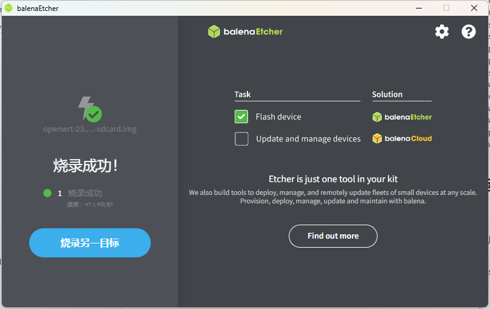
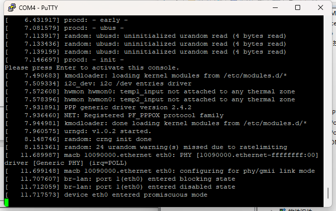

# OpenWrt on HiFive Unmatched

### 设备需求

- Host：Ubuntu or Windows
- Board: HiFive Unmatched
- microUSB 数据线一条（HiFive Unmatched 原厂已附带一根）
- ATX 电源一个

### 下载镜像

从官方网站上下载OpwnWrt固件

https://firmware-selector.openwrt.org/?version=23.05.2&target=sifiveu%2Fgeneric&id=sifive_unmatched

### 将镜像烧录进SD卡

Linux可使用dd命令将固件镜像烧录进SD卡

Windows可用balenaEther烧录镜像



### 启动镜像

将烧录好的SD卡装入开发板中

使用microSD 线缆将HiFive Unmatched连接至 Host PC

新启动一个终端，minicom/screen 等工具打开串口：

```
sudo minicom -D /dev/ttyUSB1 -b 115200
```

windows下使用putty等工具打开串口

将HiFive Unmatched上电开机h，即可在窗口看见启动输出

