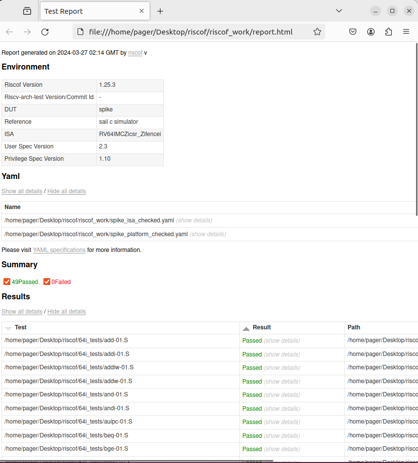

# RISCOF的测试用例自动生成工具:RISCV-CTG

## SAIL-RISCV简介

- Sail 是一种用于描述指令集架构的语言 （ISA） 处理器的语义。旨在提供工程师友好型、类似供应商伪代码的方式来描述指令语义。
- Sail-RiSCV是一个用Sail语言编写的RISC-V架构的形式化规范，基于此规范，我们可以编写与之相关的编译器，解释器，构建汇编文件，elf可执行文件，虚拟执行软件等

## RISCOF测试工具

- **RISCOF** 是RISC-V架构测试框架的缩写，它是一种用于验证RISC-V实现是否符合RISC-V规范的工具，目前覆盖了RISCV的多种扩展，同时RISCOF再验证ISA实现中使用了sail作为参照的Golden model。
- RISCOF的工作方式如下图所示


## RISCV-CTG

RISCV-CTG 是基于 RISC-V 的兼容性测试生成器。该工具用于生成官方[RISC-V 架构测试套件](https://github.com/riscv/riscv-compliance)和 RISC-V 架构测试框架[RISCOF](https://riscof.readthedocs.io/)中使用的测试用例。

CTG通过[Coverage Group Format](https://riscv-isac.readthedocs.io/en/latest/cgf.html) (CGF)文件来生成测试用例，CGF文件包含了不同指令的各种覆盖点，CTG将每个覆盖点视为约束,并使用求解器来识别潜在的解决方案。 CTG 使用[python-constraint](https://pypi.org/project/python-constraint/)包提供的约束满足问题 (CSP) 求解器来进行识别。


为了生成指定指令的测试，需要事先知道该指令的属性。该信息以 YAML 格式存储在 CTG 中，称为属性文件。

属性文件中的结构如下

```
name:                         # 指令名称
  xlen:                       # 该指令适用的 XLEN 值列表
  isa:                        # 该指令属性所属的RISC-V ISA扩展
  operation:                  # 定义了指令的功能一个Python计算字符串
  formattype:                 # 指示指令格式类型的字符串
  rs1_op_data:                # 可用作操作数 1 的合法寄存器列表
  rs2_op_data:                # 可用作操作数 2 的合法寄存器列表
  rd_op_data:                 # 可用作目标的合法寄存器列表
  rs1_val_data:               # 可用作操作数 1 的值的整数列表
  rs2_val_data:               # 可用作操作数 2 的值的整数列表
  template:                   # 一个字符串，指示用于创建测试的汇编宏。
```

例如指令“add”

```
add:
  xlen: [32,64]
  isa: I
  operation: 'hex((rs1_val + rs2_val) & (2**(xlen)-1))'
  formattype: 'rformat'
  rs1_op_data: *all_regs
  rs2_op_data: *all_regs
  rd_op_data: *all_regs
  rs1_val_data: 'gen_sign_dataset(xlen) + gen_sp_dataset(xlen,True)'
  rs2_val_data: 'gen_sign_dataset(xlen) + gen_sp_dataset(xlen,True)'
  template: |

    // $comment
    // opcode: $inst ; op1:$rs1; op2:$rs2; dest:$rd; op1val:$rs1_val;  op2val:$rs2_val
    TEST_RR_OP($inst, $rd, $rs1, $rs2, $correctval, $rs1_val, $rs2_val, $swreg, $offset, $testreg)
```

在上面的示例中，gen_sign_dataset()和gen_sp_dataset()是 CTG 中定义的自定义函数，用于生成这些字段所需的相关数据点。

## 使用CTG生成测试用例

从官方github仓库克隆代码

```
$ git clone https://github.com/riscv/riscv-ctg
```

获得源代码副本后，使用pip3进行安装

考虑到后续开发调试修改，这里添加editable参数

```
$ cd riscv_ctg
$ pip3 install --editable .
```

此时在终端输入`riscv_ctg --help`应当显示如下内容

```
Usage: riscv_ctg [OPTIONS]

Options:
  --version                       Show the version and exit.
  -v, --verbose [info|error|debug]
                                  Set verbose level
  -d, --out-dir PATH              Output directory path
  -r, --randomize                 Randomize Outputs.
  -cf, --cgf PATH                 Path to the cgf file(s). Multiple allowed.
  -p, --procs INTEGER             Max number of processes to spawn
  -bi, --base-isa [rv32e|rv32i|rv64i]
                                  Base ISA string for the tests.
  --help                          Show this message and exit.
```

之后就可以使用cgf文件进行测试用例生成了，这里以ctg仓库自带的64i为例

进入ctg仓库，在终端输入如下指令

```
$ mkdir 64i_tests/
$ riscv_ctg -v debug -d ./64i_tests/ -r -cf ./sample_cgfs/dataset.cgf -cf ./sample_cgfs/rv64i.cgf -bi rv64i -p2
```

等待ctg生成完成后，在对应的路径内便可以看见对应生成的测试用例

```
$ cd 64i_tests
$ ls
add-01.S    blt-01.S        lhu-align-01.S  slli-01.S   sraw-01.S
addi-01.S   bltu-01.S       lui-01.S        slliw-01.S  srl-01.S
addiw-01.S  bne-01.S        lw-align-01.S   sllw-01.S   srli-01.S
addw-01.S   env             lwu-align-01.S  slt-01.S    srliw-01.S
and-01.S    jal-01.S        or-01.S         slti-01.S   srlw-01.S
andi-01.S   jalr-01.S       ori-01.S        sltiu-01.S  sub-01.S
auipc-01.S  lb-align-01.S   sb-align-01.S   sltu-01.S   subw-01.S
beq-01.S    lbu-align-01.S  sd-align-01.S   sra-01.S    sw-align-01.S
bge-01.S    ld-align-01.S   sh-align-01.S   srai-01.S   xor-01.S
bgeu-01.S   lh-align-01.S   sll-01.S        sraiw-01.S  xori-01.S
```

生成的文件结构如下

```
.
├── env                             # 包含必要的环境文件
│   ├── arch_test.h                 # 包含测试中使用的宏的头文件
│   └── encoding.h                  # 包含所需各种编码的头文件
├── Jalr-01.S
.........                           #大量生成的.S文件，这些文件即为测试用例
└── Xor-01.S
```

## 在RISCOF上使用CTG生成的测试用例进行测试

生成后的测试用例可以在RISCOF上使用，这里以测试spike为例：

测试前需要环境已经安装sail模拟器 riscof和riscv-isa-sim（即spike）模拟器

创建一个新文件夹，使用setup命令初始化配置文件

```
riscof setup --dutname=spike
```

这会在当前目录下生成一个config.ini文件和spike文件夹和sail_cSim文件夹

进入spike文件夹，spike_isa.yaml和spike_platform.yaml默认记录的为RV32的测试配置，这里我们测试RV64i，因此需要修改为RV64的配置

```
# spkie_isa.yaml 内容
hart_ids: [0]
hart0:
  ISA: RV64IMCZicsr_Zifencei
  physical_addr_sz: 56
  User_Spec_Version: '2.3'
  supported_xlen: [64]
# spike_platform.yaml 内容
mtime:
  implemented: true
  address: 0xbff8
mtimecmp:
  implemented: true
  address: 0x4000
nmi:
  label: nmi_vector
reset:
  label: reset_vector
```

将之前生成的测试用例文件夹移动到当前目录，随后便可以使用`riscof run`命令进行测试和分析，测试报告会以html的形式呈现并自动使用浏览器或其他html阅读器打开

```
riscof run --config=config.ini \
           --suite=64i_tests/ \
           --env=64i_tests/env
```



## 后记

当前RISCOF官方仓库中的riscv-arch-tests中的测试用例均为CTG生成，因此使用CTG工具生成测试用例对后续开发和测试有着不可或缺的帮助
