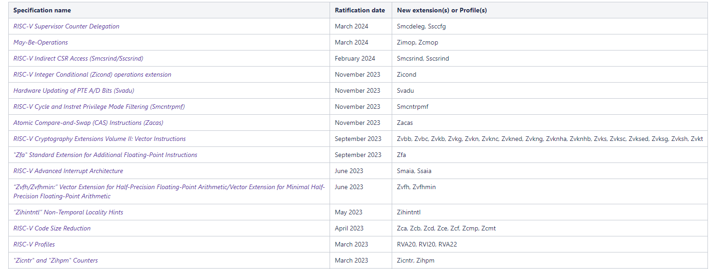

# ACT测试当前存在的不足及改进计划
汇报人：第三测试小队-朱旭昌

---

#### sail简介

Sail 是一种用于描述指令集架构的语言 （ISA） 处理器的语义。旨在提供工程师友好型、类似供应商伪代码的方式来描述指令语义。它本质上是一阶命令语言，但包含数值类型和位向量长度。Sail 被用于多个 ISA 描述，包括 Armv8-A 顺序行为的基本完整版本、RISC-V、MIPS、CHERI-RISC-V 和 CHERI-MIPS;所有这些ISA都是完备的足以启动各种操作系统。还有针对 IBM POWER 和 x86 较小片段的 Sail 模型。

#### SAIL-RISCV简介

Sail-RiSCV是一个用Sail语言编写的RISC-V架构的形式化规范，基于此规范，我们可以编写与之相关的编译器，解释器，构建汇编文件，elf可执行文件，虚拟执行软件等

---

#### RISCV-ARCH-TEST (ACT)简介

ACT是RISC-V Architecture Test SIG 对RISC-V 基础架构的一套测试，旨在帮助确保为给定 RISC-V 配置文件/规范编写的软件能够在符合该配置文件的所有实现上运行。ACT测试还有助于确保实施者正确理解并实施了规范。

ACT是一个最小的过滤器。通过ACT测试并获得 RISC-V International 批准的结果是获得 RISC-V 商标许可的先决条件。通过 RISC-V ACT测试并不意味着设计符合 RISC-V 架构。ACT只是一组基本的测试，ACT测试主要检查规范的重要问题，而不关注细节。

---

# SAIL与ACT当前测试中包含的不足
RISC-V ISA 规范涉及内容过多，导致可配置的各种测试环境功能过于复杂

---

#### 对于 Ratified Extension

Ratified Extensions即RISC-V ISA 中已经通过认定的扩展，但是并没有合并进riscv isa spec中，部分拓展如下图所示

这些拓展并没有在最新的规范中，因此无法定义这些拓展

---

#### 对于WARL型寄存器的一些操作行为无法确定

- 而由于在Zicsr中定义的CSR的读取顺序行为在某些情况下默认为弱顺序，同时WARL寄存器的读也具有很大的灵活度，具体确定这个行为指标就存在较大难度。因此WARL字段行为可能的变化实际上是无限的

#### 不受CSR控制的一些情况

- 如：如何报告处理同时到来的同一优先级的异常,在RISC-V ISA中，通常可以通过搜索“may”，“should”，“can”，“option”等词语来发现，这些行为未经ISA严格定义，因此无法对这些情况进行一个清晰的定义

### 对于明确声明为依赖于实现的内容

- 例如WARL中的字段行为就主要依赖于如何实现的内容，这些行为指标难以进行清晰的定义

---

# ACT计划中对这些进行的改进

#### 对于 Ratified Extension

ACT计划使用字符串旁匹配来过滤并配置对应的测试

#### 对于WARL型寄存器的一些操作行为无法确定

ACT计划：目前已经实现了一个所有ACT和工具都将使用的工具(riscv-config)，它定义了通用合法值语法的模式，以及一组通用非法合法值的映射

- 这是描述RISC-V 配置的规范方法，同时是运行ACT的必要条件
- 强烈建议通过禁止写入来处理将非法值写入WARL字段的行为

---

# ACT计划中对这些进行的改进

#### 不受CSR控制的一些情况

ACT计划：对此类未定义行为使用对应关键词以在riscv-config的YAML文件中声明，同时在sail中具体的实现这样的行为。

#### 对于明确声明为依赖于实现的内容

ACT计划：避免测试这些行为

---

# 在SAIL中难以实现的特性

#### 时序相关性

- 如：cycle ， realtime couters,只有“no event”是架构相关的，只有InstRet计数器是可复现的（cycle 和 mtime不是）

#### 异步行为

- 如：interrupt ， concurrent access ， snoops ， DMA ， memory ops

---

# 在SAIL中难以实现的特性

#### 非架构状态依赖以及不确定性行为

- 如cache，TLBs(Translation Lookaside Buffer，缓存) , read/write/instruction buffers , predictors（指令预测）。

#### 受约束的依赖于实现的选项不一定是固定的

- 如，未对齐情况下的加载

---

# ACT计划中对这些进行的改进

#### 时序相关性

- ACT计划：只测试架构相关以及可复现的行为，同时要求对应的实现来定义限制行为（如：mtime至少计数一次或者多次instret）

#### 异步行为

- ACT计划：实现与instret同步的伪事件生成器，通过不断模拟来确保不存在报错，同时实现一个新的或基于原有扩展的概率框架（而不是实际框架）以测试内存模型

---

# ACT计划中对这些进行的改进

#### 非架构状态依赖以及不确定性行为

- ACT计划：向Sail中添加Cache与TLB支持，从而支持类似Spike的约束测试（高效的，同时使状态架构相关）

#### 受约束的依赖于实现的选项不一定是固定的

- ACT计划：添加支持，允许trap/notrap两种情况的结果，否则认为选项是固定的，若非固定则舍弃这一行为（需要和Sail相结合）

---

## ACT后续计划工作

- 将Test_Format_Spec拆分并更新为
  
    - TestDev_Guideline_Spec:适用于测试开发人员

    - ACT_interface_Spec：适用于测试用户

- 关闭现有未解决Issue以及pr

- 添加对处理受限的非确定性结果（如未对齐的ld/st/br）和内存模型测试的支持

---

## ACT后续计划工作

- 开发用于异步和并发测试的伪设备测试

   - 中断事件发生器

   - 内存事件生成器 （LR/SC,Atomic ops,WRS,mem model（TSO,WMO））

   - 调试跟踪命令接口（Etrace,Ntrace）

- 与sail组进行合作
    - 添加使得CSR合法化以及TLB/Cache的支持
    - 开发SaiL as a Service 以及 Docker/Podman容器

---

## ACT后续计划工作

- 工具开发
    - 更加简洁的覆盖语法（针对开发测试人员）
    - GUI riscv-config实现（针对测试用户）
    - riscv-config YAML配置匹配（使得可以使用特定的配置文件进行测试）
        - 具体而言为允许检查实现是否满足配置文件要求，即是由声称支持所需的扩展并通过每个扩展的测试

- 扩展 DUT Debug 支持
    - out-of-line GPR,FP以及Vector(CSR)的断言支持
    
---

# End.