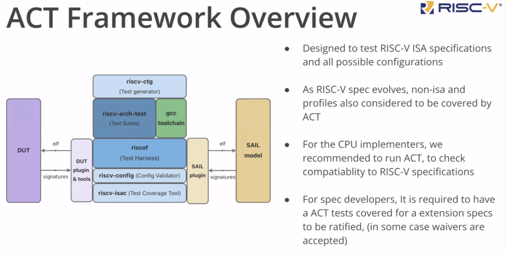
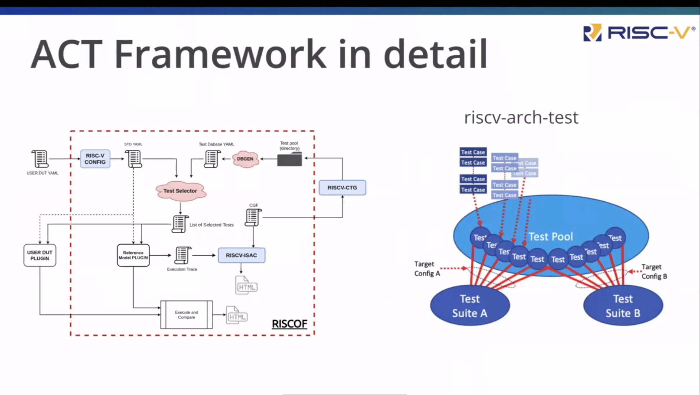
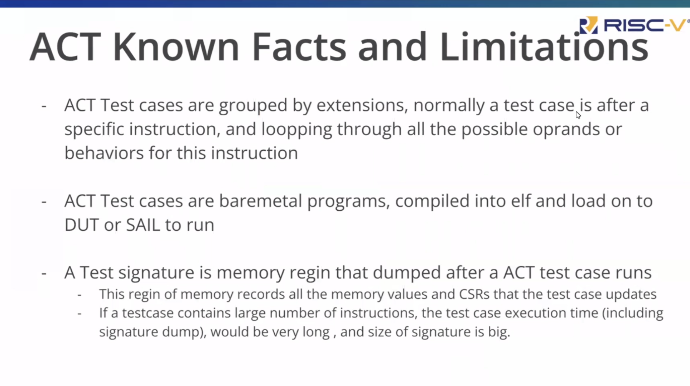
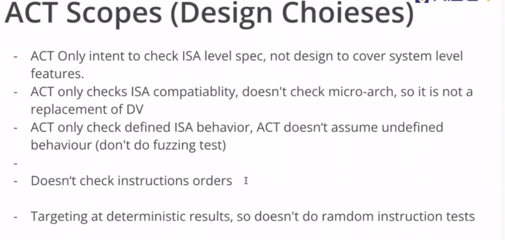

# Arch Test ACT SIG meeting 6.3

1. CSC的ACT 评估PPT

在会议上James Shi展示了上次会议所聊到的ACT CSC评估PPT,James Shi需要整理出ACT的框架，范围和功能

蓝色部分来自ACT测试框架,其他颜色的则来自于外部的测试套件，ACT的核心部分为riscof驱动着所有的测试，由于riscof基于python的工具所以使用gcc 2来编译交换机。DUT插件和Sail插件负责连接DUT和sail模型，将信息发送给他们并获取签名，然后再进行比较

ACT测试对测试流程进行了简化，实际步骤需要运行riscv-config，riscv-isac及riscv-ctg等工具，然而RISCOF将这些功能进行了整合，所以实现者仅需要执行管理及配置即可

下一个ppt是关于ACT的工作方式，通过一个特定的筛选器在测试池中寻找测试用例并进行测试

下一个ppt介绍act的主要实现的细节

ACT 测试用例按扩展分组，通常测试用例位于特定指令之后，并循环遍历该指令的所有可能的操作数或行为.

ACT 测试用例是裸机程序，编译成 elf 并加载到 DUT 或 SAlL 上运行

测试签名是 ACT 测试用例运行后转储的内存寄存器,此内存寄存器记录测试用例更新的所有内存值和 CSR。如果测试用例包含大量指令，则测试用例执行时间（包括签名转储）将非常长，并且签名的大小很大。

下一个ppt介绍act的一些缺陷

- ACT 仅用于检查 lSA 级别规范，不用于设计以涵盖系统级别功能。
- ACT 仅检查 lSA 兼容性，不检查微架构，因此它不是 DV的替代品
- ACT 仅检查定义的 lSA 行为，ACT 不假设未定义的行为（不进行模糊测试）
- 不检查指令顺序 
- 针对确定性结果，因此不进行随机指令测试

[https://docs.google.com/presentation/d/1jEt3fdtk3-YWIFNrdmMMMIZtyWtJ29d3w_bJMjutw9Q/edit#slide=id.g271bde98cc8_0_3](https://docs.google.com/presentation/d/16YKli7JOVRkhzPDYUnAllMAymwyJxgjinWEbj4I5-n0/edit)

2. ACT 发布会议，解决日志的一些方法

会议上讨论了变更日志的一些情况，James Shi的建议是保持目前的线性日志，以便每次合并或处理过程都能在同一个请求下完成。这样就可以收集每个必备条件的所有信息，并请求他们做什么以及最终变更日志的表格。当发布新版本时，将在一个目标中完成链日志的更新。同时当有pr进行合并时，会要求pr提出者在要求的描述中写上修改的内容。因此需要制作一个模板来处理这些事。当完成这些任务后，对于后续管理以及理解pr的意义有很好的作用，并且可以在最后重新冻结链接日志以得到更星期的链条日志。

